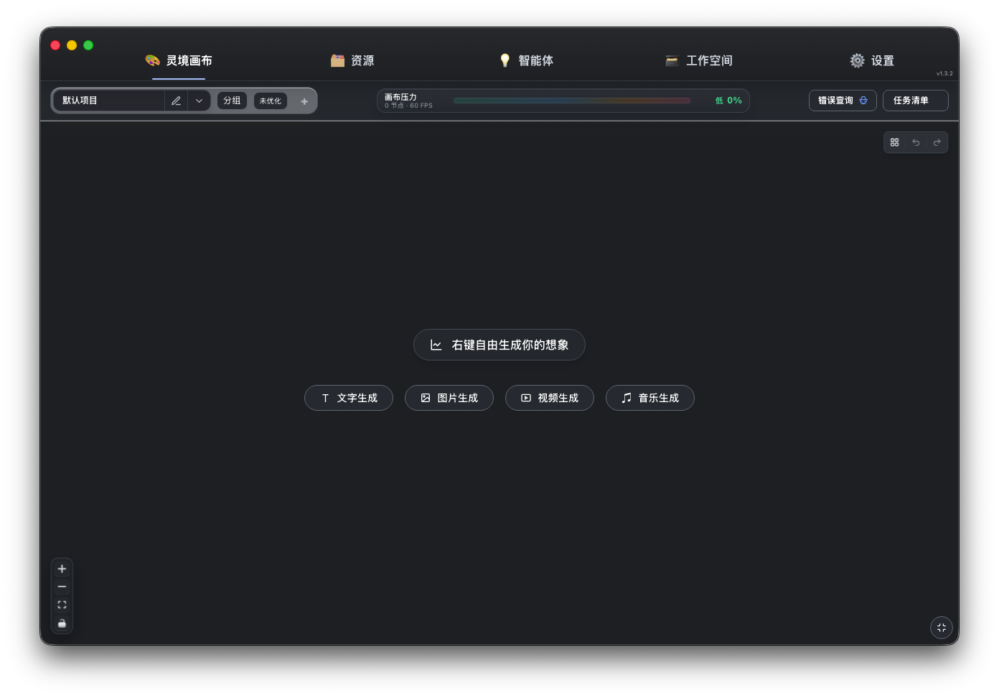
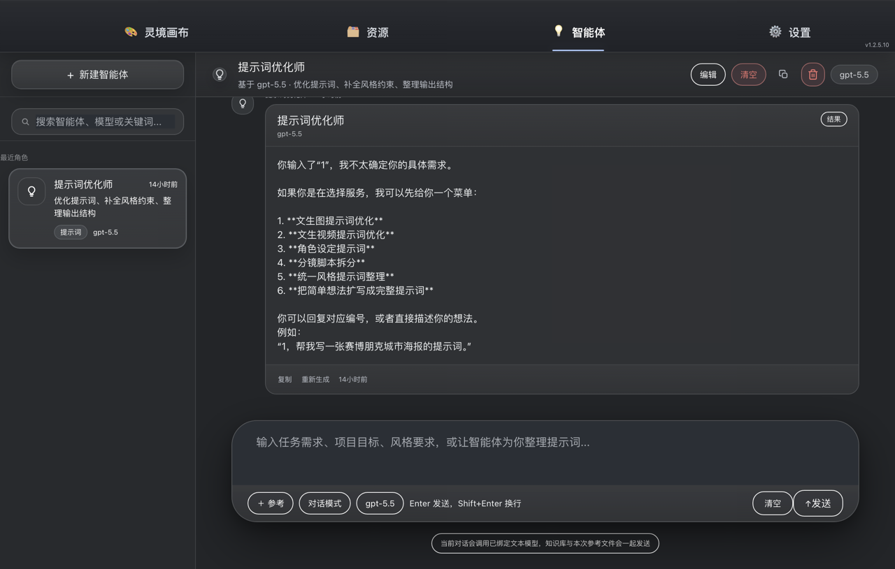
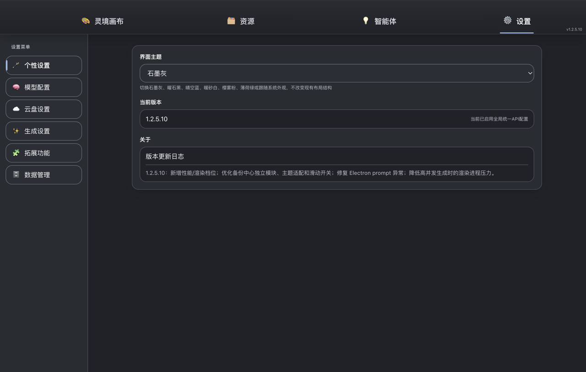
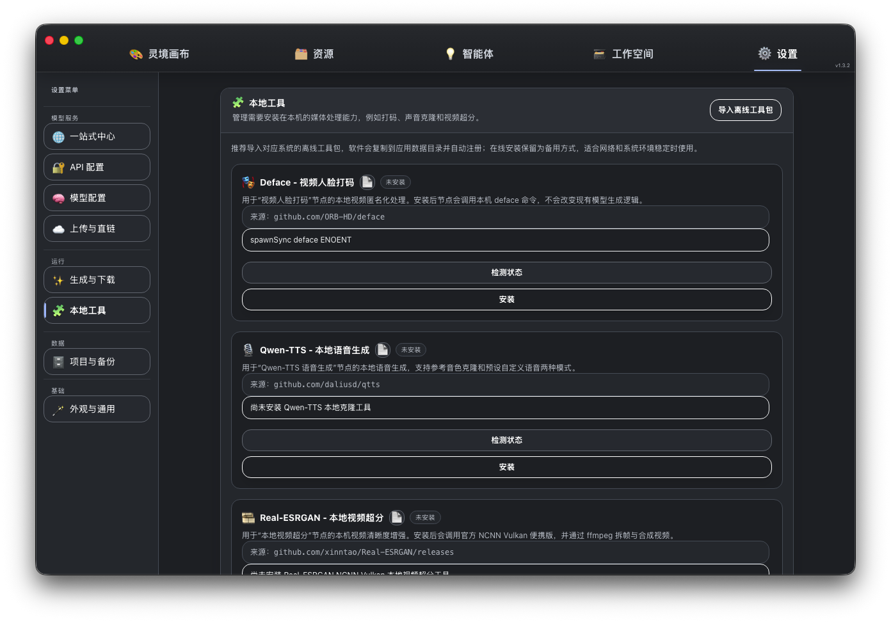
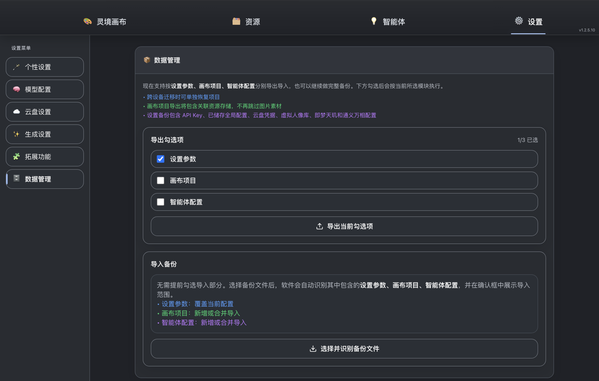

# 万卷灵境

万卷灵境是一款 macOS 桌面端的 **AI 创作画布应用**。它把文本、图像、视频、音频、音乐等多种 AI 生成能力，集成到一块自由的可视化画布上——你可以像搭积木一样，把不同的 AI 节点连在一起，让一个节点的产出成为下一个节点的输入，完成从灵感到成品的完整创作流程。

> 适用于 Apple Silicon（M 系列芯片）的 Mac。



---

## 它能做什么

- **一块画布，多种 AI**：在同一张画布上自由摆放图像、视频、音频、音乐、文本节点，节点之间可以连线、互相引用，把多个 AI 模型串成你自己的创作流水线。
- **接入你自己的模型**：通过「配置管家」，填入中转站的接口地址、令牌和 API 文档，应用会自动识别该站点下的所有模型并配好调用方式，让它们直接在画布上可用。支持文本、图像、视频、音频、音乐等各类模型。
- **自动保存与备份**：创作过程自动存档，内置「备份中心」可随时查看、恢复历史快照；也能把项目和素材导出，在另一台设备导入，跨设备迁移无忧。
- **多项目管理**：可以同时维护多个画布项目并分组归类，互不干扰，随时切换。

---

## 四大界面

### 🎨 灵境画布
核心创作区。在这里新建各类生成节点，填写提示词、选择模型、发起生成。节点之间可拖拽连线——例如把一张生成的图片接到视频节点作为首帧，或把一段文本接到图像节点作为提示词来源。画布支持自由缩放、平移，并提供性能档位调节，节点再多也能流畅操作。

顶部工具栏可实时查看画布压力（节点数、帧率），还能一键打开**任务清单**查看所有生成任务的进度；失败的任务可以直接拉回结果。

### 🗂️ 资源
统一管理你在创作中用到和生成的素材——图片、视频、音频、文本一目了然，可按类型筛选、收藏、清理，方便随时取用。


### 💡 智能体
可以创建多个「智能体」，给每个智能体设定角色、绑定模型、撰写提示词、挂载知识库摘要。在对话式界面里与智能体交流，让它帮你梳理需求、优化提示词或直接产出内容，产物也能回流到画布继续加工。



### ⚙️ 设置
- **个性设置**：界面主题（曜石黑 / 石墨灰 / 晴空蓝 / 暖砂等）与外观偏好。
- **模型配置 / 配置管家**：管理 API 配置，通过配置管家批量或单个地接入模型。
- **云盘设置**：配置素材的云端上传方式。
- **生成设置**：默认并发数、性能与渲染档位、自动下载等。
- **数据管理**：导入导出、备份中心、定时备份。



---

## 配置管家：接入你的模型

「配置管家」是接入模型的核心工具，有两种模式：

- **全局批量模式**：给它一个中转站的接口地址、令牌和 API 文档链接，它会读取文档、识别该站点下的所有模型，并为每个模型自动生成正确的请求协议（请求发送、任务轮询、结果获取）。每个中转站对应一份独立的全局配置，切换配置时，文本 / 图像 / 视频 / 音频 / 音乐所有模型会整体跟着切换，不同站点之间互不影响。
- **单模型模式**：针对某个站点里的单个模型单独生成配置。

配好的模型即可直接在画布对应类型的节点上使用。



数据管理中的「备份中心」可查看与恢复历史快照，支持定时备份与跨设备的导入导出：



---

## 安装

1. 在 [Releases](../../releases) 下载最新的 `万卷灵境-x.x.x-arm64.dmg`。
2. 双击打开，把「万卷灵境」拖入「应用程序」文件夹。
3. 首次打开时，若系统提示无法验证开发者，右键点击应用图标 →「打开」即可。

---

## 从源码运行 / 构建

需要 Node.js 与 npm。

```bash
npm install          # 安装依赖
npm start            # 启动应用
npm run build:web    # 构建前端
npm run build        # 打包成 .app / .dmg（Apple Silicon arm64）
```

技术栈：Electron + React + Vite。

---

## 关于

万卷灵境，专注于把分散的 AI 能力收拢到一块顺手的创作画布上，让「想法 → 生成 → 再加工 → 成品」的过程尽可能简单流畅。

欢迎在 Issues 中提出使用问题或功能建议。
